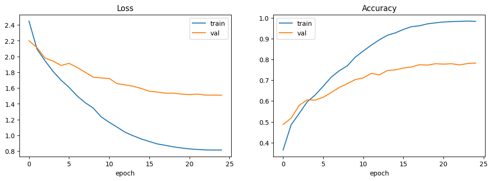
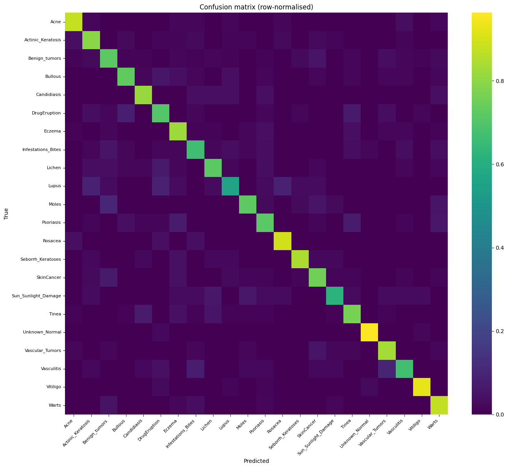
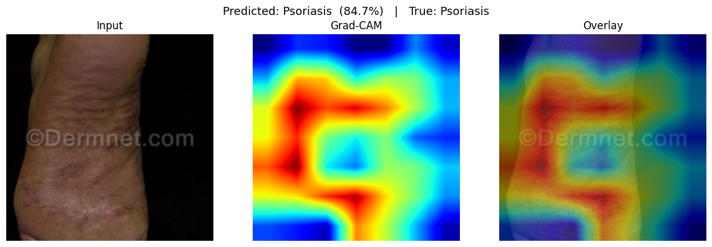
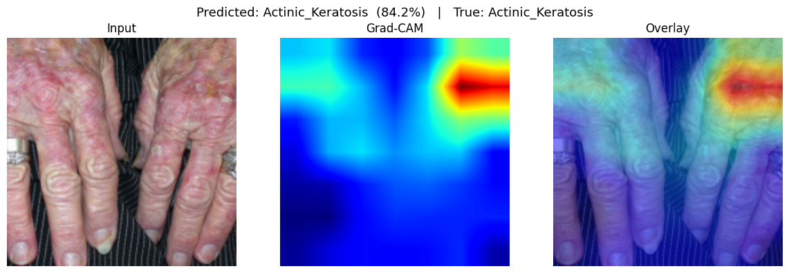
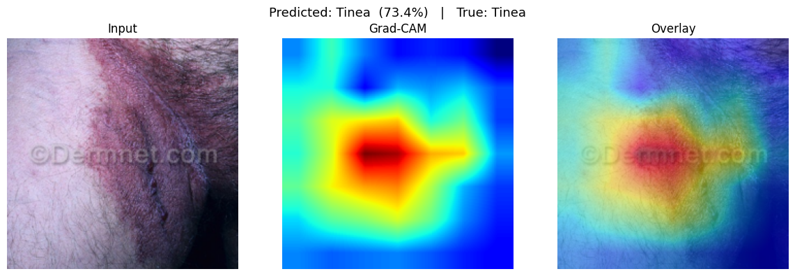

# Skin Disease Image Classifier

Transfer-learning image classifier for a **22-class skin disease dataset**
(Acne, Eczema, Psoriasis, Melanoma/Skin Cancer, Vitiligo, …). Designed to be
**trained on Google Colab** — the dataset is pulled from Kaggle directly onto
the Colab VM, so nothing needs to be downloaded to your local machine.

> ⚠️ **Medical disclaimer:** This is a portfolio/research project. It is **not**
> a diagnostic tool and must not be used for clinical decisions.

---

## Project structure

```
.
├── configs/
│   └── default.yaml          # All hyperparameters / paths
├── notebooks/
│   ├── trained_colab.ipynb   # End-to-end Colab training run (with results)
│   └── grad_cam_colab.ipynb  # Grad-CAM explainability run (with results)
├── assets/                   # Rendered result images used in this README
├── scripts/
│   └── train.py              # CLI training entry point
├── src/
│   ├── data/
│   │   ├── labels.py         # Canonical 22 class names + lookups
│   │   ├── transforms.py     # Train/eval image transforms
│   │   └── datamodule.py     # Layout-agnostic dataset + dataloaders
│   ├── models/
│   │   └── model.py          # torchvision backbones + custom head
│   ├── training/
│   │   ├── trainer.py        # AMP, scheduling, class weights, early stop
│   │   └── metrics.py        # Accuracy / F1 / confusion matrix
│   ├── inference/
│   │   ├── predict.py        # Load checkpoint -> predict single image
│   │   └── gradcam.py        # Grad-CAM heatmap explanations
│   └── utils/
│       ├── config.py         # Typed YAML config (dataclasses)
│       └── seed.py           # Reproducibility
├── requirements.txt
└── .gitignore
```

## Quick start (Google Colab) — recommended

1. Push this project to a GitHub repo.
2. Open `notebooks/trained_colab.ipynb` in Colab and select a **GPU** runtime.
3. Set `REPO_URL` to your repo, run the cells top to bottom.
4. Provide Kaggle credentials — either add `KAGGLE_USERNAME` / `KAGGLE_KEY` as
   Colab secrets (recommended), or upload your `kaggle.json` when prompted
   (Kaggle → Account → *Create New API Token*).
5. The dataset (`pacificrm/skindiseasedataset`) is fetched via `kagglehub`,
   then the notebook trains, evaluates, plots a confusion matrix, and saves the
   best checkpoint to your Google Drive.

## Quick start (local)

```bash
pip install -r requirements.txt

# Download the dataset via kagglehub (uses ~/.kaggle/kaggle.json or env vars):
python -c "import kagglehub; print(kagglehub.dataset_download('pacificrm/skindiseasedataset'))"

# Then point training at the printed path:
python -m scripts.train --config configs/default.yaml --data-dir /path/from/above
```

The data module auto-detects the dataset layout:
- `train/` + `test/` (and optional `val/`) subfolders, **or**
- a single folder with one subfolder per class (an automatic stratified
  train/val/test split is created).

## Results

Trained on a free Colab **Tesla T4** with EfficientNet-B0 (ImageNet-pretrained),
25 epochs with early stopping, AdamW + cosine schedule, class-weighted loss.
Evaluated on a held-out **stratified test split of 1,546 images**.

| Metric | Value |
|--------|------:|
| **Test accuracy** | **79.3%** |
| Macro F1 | 0.767 |
| Weighted F1 | 0.793 |

Macro-F1 ≈ weighted-F1 ≈ accuracy, which means the model performs consistently
across classes rather than riding the largest ones — the inverse-frequency class
weighting is doing its job against the dataset's ~7:1 imbalance.

### Training curves



Validation accuracy climbs to ~78% and plateaus while train accuracy keeps rising
toward ~98% — expected mild overfitting, contained by augmentation, dropout, label
smoothing, and early stopping (the best-val checkpoint is kept).

### Confusion matrix (row-normalised)



A strong diagonal overall. **Best classes:** Unknown/Normal (F1 0.97), Vitiligo
(0.93), Acne (0.88), Seborrheic Keratoses (0.85). **Hardest:** Lupus (0.57),
Sun/Sunlight Damage (0.67), Drug Eruption (0.68) — clinically ambiguous,
inflammatory conditions that visually mimic other rashes and have fewer samples.

### Grad-CAM explainability

Grad-CAM overlays show **where** the model looks. The hot (red) regions sit on the
actual lesions rather than the background or watermarks — evidence the model learned
meaningful features rather than dataset shortcuts.

| Psoriasis (84.7%) | Actinic Keratosis (84.2%) | Tinea (73.4%) |
|---|---|---|
|  |  |  |

> **Caveat:** the dataset images carry a "Dermnet.com" watermark. Spot-checking
> Grad-CAM confirms the heatmaps focus on lesions, not the watermark — but this is
> worth monitoring as a potential shortcut.

## Inference

```python
from src.inference import SkinDiseasePredictor

predictor = SkinDiseasePredictor("outputs/checkpoints/best.pth")
print(predictor.predict("some_image.jpg", top_k=5))
```

### Grad-CAM

```python
from src.inference import SkinDiseaseGradCAM

explainer = SkinDiseaseGradCAM("outputs/checkpoints/best.pth")
result = explainer.explain("some_image.jpg")   # heatmap on the predicted class
print(result["label"], result["probability"])  # result["overlay"] is the image
```

See `notebooks/grad_cam_colab.ipynb` for an end-to-end Colab example.

## Configuration

Everything is driven by [configs/default.yaml](configs/default.yaml) — backbone,
image size, batch size, optimizer/scheduler, class weighting, early stopping,
mixed precision, and output paths. Override fields on the CLI (`--epochs`,
`--batch-size`, `--backbone`) or directly in the notebook.

## The 22 classes

Acne · Actinic Keratosis · Benign Tumors · Bullous · Candidiasis · Drug
Eruption · Eczema · Infestations/Bites · Lichen · Lupus · Moles · Psoriasis ·
Rosacea · Seborrheic Keratoses · Skin Cancer · Sun/Sunlight Damage · Tinea ·
Unknown/Normal · Vascular Tumors · Vasculitis · Vitiligo · Warts
